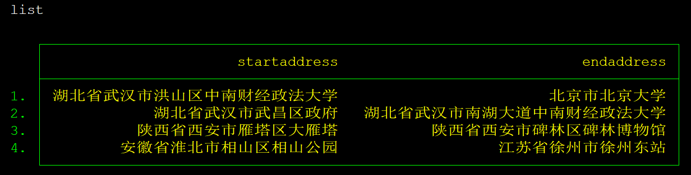
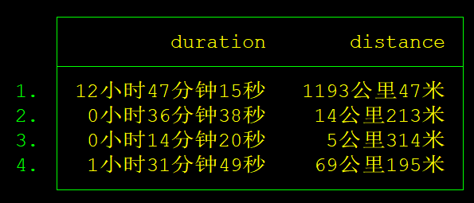
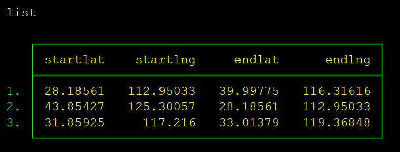
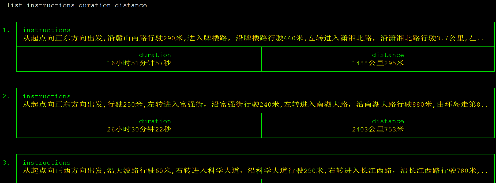

# cntraveltime
cntraveltime: 求得两地之间不同出行方式所耗时长

## 文档语言声明(Language statement)

Stata作为全球知名的统计分析软件，其外部命令的主流书写语言为英文。但由于本命令的使用人群主要是中文区用户，因此README也使用中文书写，以提高大家的使用效率，同时sthlp文件为英文版，兼顾其它地区人群使用。

Stata as the world's leading statistical analysis software, the external command of the mainstream writing language is English.However, due to the fact that the users of this program are mainly Chinese users, the README documents are also written in Chinese so as to enhance the efficiency of everyone's use.At the same time sthlp file for the English version, taking into account the use of other regions of the population.

## 概述

cntraveltime 命令通过调取百度地图API，可以求得两地之间(中国境内)各种交通出行方式所耗时间。它所需要的参数可以是经纬度坐标，也可以是中文描述，如果输入的是中文描述，如“北京市海淀区清华大学”，cntraveltime会自动查询所在经纬度并进行提交，因此如果使用中文描述，请尽量描述详细，以免百度地图发生识别错误。

## 安装

### 百度地图API密钥

若要使用本命令，需要在[百度地图开放平台](http://lbsyun.baidu.com/) 申请地图API密钥，cntraveltime的实现机制也是通过调取API获得其中的信息，并作出相应的处理与加工。在本篇说明中所使用的密钥均经过修改。

### cntraveltime

在Stata中使用github命令下载，关于如何使用github下载github站点内的命令，可以参见爬虫俱乐部的往期推文 [《SSC的好兄弟“github”》](https://stata-club.github.io/%E6%8E%A8%E6%96%87/SSC%E7%9A%84%E5%A5%BD%E5%85%84%E5%BC%9F%E2%80%9Cgithub%E2%80%9D/)


```
github install stata-club/cntraveltime
```

## 使用方法示例

首先我们在Stata中输入如下命令生成示例数据集

```
clear
set more off
input str100 startaddress str100 endaddress
"湖北省武汉市洪山区中南财经政法大学" "北京市北京大学"
"湖北省武汉市武昌区政府" "湖北省武汉市南湖大道中南财经政法大学"
"陕西省西安市雁塔区大雁塔" "陕西省西安市碑林区碑林博物馆"
"安徽省淮北市相山区相山公园" "江苏省徐州市徐州东站"
end

```



可以看到，现在数据集有两个变量，`起点地址` 与 `终点地址` ，现在我们使用cntraveltime 命令求出从起点地址到重点地址所耗时间。(baidukey已修改过)

```
cntraveltime, baidukey(RkwfPwjwfrn3P5XZoNKz7BScyoZvW) startaddr(startaddress) endaddr(endaddress)

list duration distance

```



我们同样可以引入经纬度作为起点与重点的变量，准备如下示例数据集


```
clear
set more off
input double startlat double startlng double endlat double endlng
28.18561 112.95033 39.99775 116.31616
43.85427 125.30057 28.18561 112.95033
31.85925 117.21600 33.01379 119.36848
end
```



可以看到，现在数据集有四个变量，`起点经纬度` 与 `终点经纬度` ，现在我们使用cntraveltime 命令求出从起点地址到重点地址所耗时间，以及如何到达的指引。(baidukey已修改过)

```
 cntraveltime, baidukey(RkwfPwjwfrn3P5XZoNKz7BScyor0nZvW) start_lat(startlat) start_lng(startlng) end_lat(endlat) end_lng(endlng) detail
```



## 使用场景

> 如果你想知道从本地去某地需要多长时间，我们推荐你使用cntraveltime
> 如果您想知道从成千上万个起点到成千上万个终点各需要多长时间，我们向您强烈推荐本命令，它就是为批量获取、处理该类信息量身打造的。

### 空间计量

如果您现在正在做的研究与空间计量有关，会涉及到使用从A地到B地的空间直线距离等数据，我们强烈推荐您使用cntraveltime。cntraveltime的默认结果是返回从A地到B地的所需时间与对应的距离，这个距离不是直线距离，而是经过计算，最短的实际距离，而时间也是与距离相对应的耗费时间。我们认为，在相关研究中提供实际距离会比空间距离更加具有说服力与话题性，在新度与信度上都具备很好的素质。

### 地域关系

如果您现在的研究会需要从某地到许多地方所经过的路线(如国道，省道，县道)，从而研究某地的地域关系等问题，则您可以使用cntraveltime批量获取相关信息，当您在选项中加入 instruction ，则命令会返回从A地到B地所经过的详细路线。


## 参数介绍

### baidukey(str)

在这个参数下填入你自己的百度地图API密钥，关于如何获取百度地图密钥，[请访问这里](http://lbsyun.baidu.com/apiconsole/key/create) 

在这里需要注意的是，如果您所提供的参数是经纬度的话，cntraveltime会直接进行查询，即仅耗费一次查询，如果您所提供的参数是中文描述，则cntraveltime会额外再查询一次其所在的经纬度，因此如果您需要进行较大规模数据查询，请尽量使用经纬度作为参数以提高搜索效率，节省搜索额度。

### start_lat(varname) & start_lng(varname)

起点`经纬度变量`，如果您关于地点的参数为经纬度，请使用该选项。该选项必须两两出现，并且不能与 startaddr(varname) 同时出现。

end_lat(varname) & end_lng(varname) 作为终点`经纬度变量`，同上。

### startaddr(varname) & endaddr(varname)

起(终)点地址变量，如果您关于地点的参数为中文描述，请使用该选项，并且不能与 `经纬度变量` 同时出现。

### instruction

该选项可以增加一列返回的变量 `instructions` ，该变量记述了由起点到终点的具体路程导引。如果不加该选项，默认是不返回 instructions

### xml

该选项可以增加一列返回的变量 `xmlcode` ，该变量记述了本次查询中，百度返回的xml源代码。如果不加该选项，默认是不返回 `xmlcode`

### detail

展示一切可以展示的内容，如 `xmlcode` `instruction`

### public(str)

该选项用于指定所使用的交通工具的偏好。

如果您想知道如果是自己驱车从A地到B地的情况，请不要使用public，命令默认即为私人驱车，如果在选项中使用了 public 选项，则命令自动切换为公共交通工具的情况。即便public()中的关键词并没有如下五个中的一个。


- public(plane) 如果两个地点是跨市状态，如起点是徐州市内某个地方，终点是北京市内某个地方，则这个选项会优先考虑乘坐飞机，如果不添加该选项，默认为乘坐火车跨市。
- public(bus) 如果两个地点是跨市状态，这个选项会优先考虑乘坐飞机，如果不添加该选项，默认为乘坐火车跨市。
- public(straight) 如果两个地点是同市状态，如起点和终点都处在苏州市内某个地方，则该选项会选择尽量少换乘的路线并计算耗时与距离
- public(nowalk) 如果两个地点是同市状态，则该选项会选择尽量少步行。
- public(shorttime) 如果两个地点是同市状态，则该选项会选择最快时间到达。